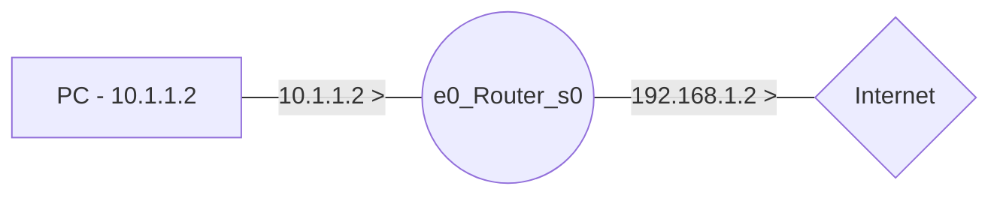
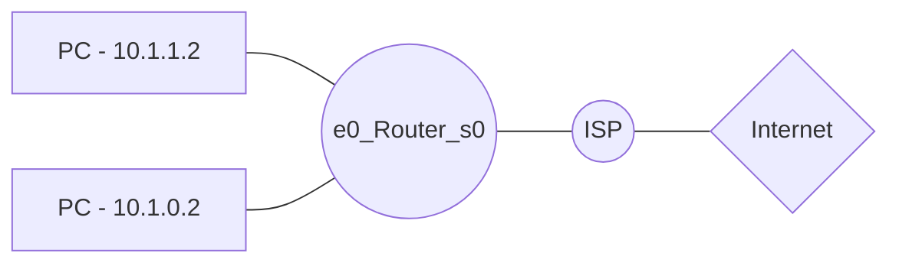
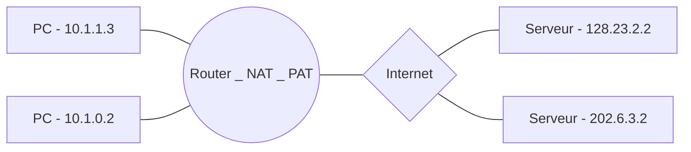
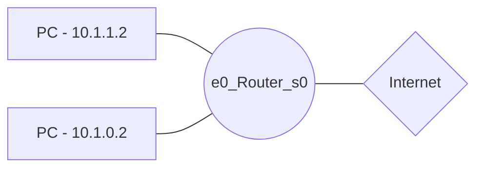

# NAT
**N**etwork **A**ddress **T**ranslation

A little introduction about NAT is coming. Not now. Later :)

## Static Address Translation

### Configuring Static NAT

Allocate one adress to a unique address.

|Interfaces| Networks|
|---|---|
|E0|10.1.1.1|
|S0|192.168.1.1|


```
Unknown(config)# hostname Router
Router(config)# ip nat inside source static 10.1.1.2 192.168.1.2
Router(config)# interface ethernet 0
Router(config-if)# ip address 10.1.1.1 255.255.255.0
Router(config-if)# ip nat inside
-
Router(config)# interface serial 0
Router(config-if)# ip address 192.168.1.1 255.255.255.0
Router(config-if)# ip nat outside
```

## Dynamic Address Translation

Allocate a range of private addresse to a range of public addresses.

|Interfaces| Networks|
|---|---|
|E0|10.1.1.1|
|S0|192.168.1.1|



**ISP** are **I**nternet **S**ervice **P**rovider (FAI in French).
The ISP rule here is : 
**192.168.1.1 ---> 179.9.8.0/24**
```
Router(config)# ip nat pool NAT-POOL1 179.9.8.80 179.9.8.95 netmask 255.255.255.0
Router(config)# nat inside source list 42 pool NAT-POOL1

Router(config)# interface ethernet 0
Router(config-if)# ip address 10.1.1.1 255.255.0.0
Router(config-if)# ip nat inside
-
Router(config)# interface serial
Router(config-if)# ip address 192.168.1.1 255.255.255.0
Router(config-if)# ip nat outside
-
Router(config)# access-list 42 permit 10.1.0.0 0.0.255.255
```

First line : Give a range of addresses to the router. It could dynamically use one address from 179.9.8.80 to 179.9.8.95.

# PAT
**P**ort **A**ddress **T**ranslation, alias Port Fowarding

## Example

### Common example



#### Before the Router

| DA | SA | DP | SP | Data
|-|-|-|-|-
|128.23.2.2|10.0.0.3 | 80 | 1331 | x

> DA : Destination Address
> SA : Source Address
> DP : Destination Port
> SP : Source Port

#### After the Router

| DA | SA | DP | SP | Data
|-|-|-|-|-
|128.23.2.2|10.0.0.3 | 80 | 3333| x

### Cisco Example

192.168.1.1 is the address your ISP has assigned you.
Instead of a host, you put a router there, running PAT
so you can have multiple hosts share that same
192.168.1.1 address.

|Interfaces| Networks|
|---|---|
|E0|10.1.1.1|
|S0|192.168.1.1|



```
Router(config)# access-list 12 permit 10.1.0.0 0.0.255.255
Router(config)# ip nat pool NAT-POOL2 179.9.8.20 netmask 255.255.255.240
Router(config)# ip nat inside source list 12 pool NAT-POOL2 overload
```

